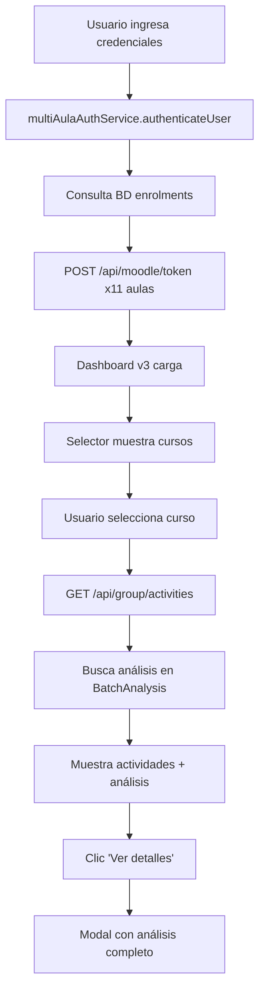

# 📊 Análisis Completo del Dashboard Académico UTEL

## 🔍 **¿Qué hace el proyecto?**

**UTEL Dashboard Académico** es un **asistente inteligente para profesores** que integra múltiples aulas virtuales de Moodle con IA (OpenAI GPT-4) para generar análisis automáticos del desempeño estudiantil. El sistema permite a los docentes obtener insights accionables sin revisar manualmente todo el contenido de sus cursos.

---

## 🏗️ **Flujo Completo desde Login hasta Análisis**

### **1. 🔐 PROCESO DE AUTENTICACIÓN**

**Archivo: `lib/auth/auth-options.ts:20-78`**

```typescript
// PASO 1: Usuario ingresa credenciales Moodle
const authResult = await multiAulaAuthService.authenticateUser(
  credentials.username,
  credentials.password
)
```

**Archivo: `lib/auth/multi-aula-auth-service.ts:64-169`**

```typescript
// PASO 2: Validación multi-aula automática
async authenticateUser(username: string, password: string) {
  // 1. Consulta base de datos de enrolments
  const userEnrolments = await this.findUserEnrolments(username)

  // 2. Valida credenciales en CADA aula donde está enrolado
  for (const enrolment of userEnrolments) {
    const aulaResult = await this.validateCredentialsInAula(
      username, password, enrolment.aulaId, enrolment.aulaUrl
    )
  }

  // 3. Obtiene cursos donde es profesor
  const professorCourses = await this.getProfessorCoursesAndGroups(validAulas)
}
```

**Proceso interno detallado:**
1. **Query BD**: `SELECT DISTINCT idAula FROM enrolment WHERE username = ? AND roles_id = 17`
2. **Llamada API**: `POST /api/moodle/token` para cada aula
3. **Validación**: Verifica tokens en 11 aulas UTEL simultáneamente
4. **Fallback**: Si falla, usa service tokens administrativos
5. **Sesión**: Almacena `multiAulaData` con tokens válidos

### **2. 🎯 CARGA DEL DASHBOARD**

**Archivo: `app/dashboard/v3/page.tsx`** → Redirige a Dashboard v3

**Archivo: `components/dashboard/batch-dashboard-content.tsx:230-240`**

```typescript
// Al cargar el dashboard
useEffect(() => {
  loadSyncStatus()  // Obtiene estado del sistema batch
}, [])

// Al seleccionar curso
const handleCourseChange = async (courseId: string) => {
  setSelectedCourse(courseId)
  await loadGroupActivities(courseId)  // Carga actividades
}
```

### **3. 📚 SELECCIÓN DE CURSO Y CARGA DE ACTIVIDADES**

**Archivo: `components/dashboard/batch-dashboard-content.tsx:155-205`**

```typescript
const loadGroupActivities = async (courseId: string) => {
  // 1. Parsear courseId formato "courseId|groupId"
  const [courseNumber, groupId] = courseId.split('|')

  // 2. Encontrar curso para obtener aulaUrl
  const selectedCourse = courses.find(c => c.id === courseId)
  const aulaUrl = selectedCourse?.aulaUrl

  // 3. Construir parámetros de consulta
  const params = new URLSearchParams({
    courseId: courseNumber,
    groupId: groupId || '0'
  })

  if (aulaUrl) params.append('aulaUrl', aulaUrl)

  // 4. Llamada a API
  const response = await fetch(`/api/group/activities?${params}`)
  const data = await response.json()
  setGroupActivities(data.activities || [])
}
```

**Archivo: `app/api/group/activities/route.ts`** (Endpoint clave)

```typescript
// LLAMADA INTERNA:
export async function GET(request: NextRequest) {
  // 1. Extrae parámetros (courseId, groupId, aulaUrl)
  // 2. Extrae aulaId de la URL
  // 3. Busca análisis en BD usando formato "aulaId-courseId"
  // 4. Retorna actividades con sus análisis asociados
}
```

### **4. 🤖 SISTEMA DE ANÁLISIS CON IA**

**Archivo: `lib/ai/openai-client.ts:56-85`**

```typescript
async analyzeForumContent(input: ForumAnalysisInput): Promise<AnalysisResult> {
  // 1. Construye prompt educacional especializado para UTEL
  const prompt = this.buildEducationalAnalysisPrompt(input)

  // 2. Llamada a OpenAI GPT-4
  const completion = await this.getClient().chat.completions.create({
    model: "gpt-5-mini",
    messages: [{ role: "user", content: prompt }],
    max_completion_tokens: 4000,
  })

  // 3. Parsea respuesta a formato estructurado
  return this.parseEducationalAnalysisResponse(response)
}
```

**Prompt educacional especializado (líneas 158-173):**
```typescript
`Eres un asistente del profesor en la Universidad UTEL. Tu tarea consiste en ayudarle a identificar insights accionables que contribuyan al cumplimiento de los objetivos del curso acerca del comportamiento de sus estudiantes dentro de las actividades en el foro de discusión.

- Redacta con un estilo conversacional dirigido al profesor
- El análisis debe estructurarse en al menos 5 dimensiones
- Cada dimensión debe presentarse con el formato:
  #### [Nombre de la dimensión]
  * Incluye hallazgos clave en viñetas
  **Acción sugerida:** recomendación específica y accionable
- Ordena las dimensiones de mayor a menor impacto
- El formato de entrega solo es markdown`
```

### **5. 📊 SISTEMA BATCH (Procesamiento Masivo)**

**APIs del Sistema Batch:**

```typescript
// Sincronización completa de todas las aulas
POST /api/batch/sync-and-analyze
GET  /api/batch/status
GET  /api/batch/sync-status

// Datos almacenados en BD
BatchAnalysis: {
  aulaId: "aula101",
  courseId: 375,
  analysisType: "ACTIVITY_DETAIL",
  analysisText: "Análisis en markdown...",
  keyInsights: {...},
  recommendations: {...}
}
```

---

## 🗄️ **Base de Datos - Flujo de Datos**

### **Tablas Principales y su Función:**

```sql
-- SISTEMA LEGACY (funcional)
Course          -- Cursos sin usuarios persistentes
Group           -- Grupos dentro de cursos
AnalysisResult  -- Análisis generados por IA
ActivityAnalysis -- Análisis de actividades individuales

-- SISTEMA BATCH (nuevo, operativo)
Aula            -- 11 aulas UTEL configuradas
AulaCourse      -- Cursos activos en cada aula
CourseActivity  -- Actividades (foros, tareas, quizzes)
BatchAnalysis   -- Análisis pre-generados por sistema batch
BatchJob        -- Jobs de sincronización masiva

-- SOPORTE
CourseCache     -- Cache persistente (1 hora TTL)
AnalysisQueue   -- Cola de análisis pendientes
JobLog          -- Logs de ejecución
```

---

## 🔄 **Llamadas API y Flujo de Datos Completo**

### **Flujo Principal:**



### **APIs Críticas en el Flujo:**

1. **`POST /api/moodle/token`** - Autenticación por aula
2. **`GET /api/group/activities`** - Obtiene actividades + análisis
3. **`POST /api/batch/sync-and-analyze`** - Procesamiento masivo
4. **`GET /api/batch/status`** - Estado del sistema

---

## ⚡ **Funcionalidades Actuales (Operativas)**

### **✅ COMPLETAMENTE FUNCIONALES:**

**🔐 Autenticación Multi-Aula**
- Validación simultánea en 11 aulas UTEL
- Gestión híbrida de tokens (profesor + servicio)
- Fallback automático entre credenciales
- Sesiones de 30 días con renovación automática

**📊 Dashboard v3 con Sistema Batch**
- Selector dinámico de cursos
- Carga automática de análisis pre-generados
- Vista detallada con 4 dimensiones de análisis
- Cache persistente de 1 hora

**🤖 Análisis con IA OpenAI GPT-4**
- Prompts educacionales especializados para UTEL
- Análisis en 5+ dimensiones pedagógicas
- Formato markdown con insights accionables
- Detección automática de riesgos académicos

**🔍 Detección de Actividades**
- Identifica foros, tareas y quizzes activos
- Extrae datos de participación estudiantil
- Análisis de interacciones entre pares
- Métricas de engagement y calidad

### **⚠️ PARCIALMENTE IMPLEMENTADAS:**

**🔄 Workers Batch**
- Funcionales pero en optimización
- Procesamiento cada 4 horas (configurable)
- Cron scheduler operativo pero básico

**📝 Análisis de Tareas**
- Implementado parcialmente
- Se enfoca principalmente en foros
- Análisis de assignments en desarrollo

**⚙️ Dashboard Admin**
- Funcional pero interface básica
- Análisis manuales disponibles
- Reportes de ejecución limitados

---

## 🚫 **Funcionalidades Faltantes/Mejoras Necesarias**

### **🔴 CRÍTICAS (Impacto Alto):**

1. **📈 Análisis de Calificaciones**
   - No analiza gradebook de Moodle
   - Falta correlación participación-rendimiento
   - Sin predicción de riesgo académico cuantitativo

2. **📧 Sistema de Notificaciones**
   - No hay alertas automáticas para profesores
   - Sin emails de reportes semanales
   - Falta integración con calendario académico

3. **📊 Métricas Comparativas**
   - Sin comparación entre grupos
   - Falta análisis longitudinal (evolución temporal)
   - Sin benchmarks institucionales

### **🟡 IMPORTANTES (Impacto Medio):**

4. **👥 Gestión de Estudiantes**
   - No almacena datos de estudiantes
   - Sin seguimiento individual persistente
   - Falta identificación de patrones recurrentes

5. **📱 Interfaz Móvil**
   - Dashboard no optimizado para móvil
   - Sin PWA (Progressive Web App)
   - UX limitada en dispositivos pequeños

6. **🔗 Integraciones Externas**
   - Sin integración con SIS (Student Information System)
   - Falta conexión con herramientas de videoconferencia
   - Sin exportación a Excel/PDF

### **🟢 DESEABLES (Impacto Bajo):**

7. **🎨 Personalización**
   - Dashboard no personalizable por profesor
   - Sin temas/colores institucionales
   - Falta configuración de alertas personalizadas

8. **📈 Analytics Avanzados**
   - Sin machine learning predictivo
   - Falta análisis de sentimientos
   - Sin recomendaciones pedagógicas automáticas

---

## 🏛️ **Arquitectura Técnica Detallada**

### **Stack Tecnológico:**

```typescript
Frontend: Next.js 14.2.32 + TypeScript + Tailwind CSS
Backend: Next.js API Routes + Prisma ORM
Base de Datos: PostgreSQL (dev) / MySQL (prod)
IA: OpenAI GPT-4 (gpt-5-mini)
Autenticación: NextAuth.js + JWT
Integración: Moodle Web Services API (11 aulas)
UI: Radix UI + Shadcn/ui + FontAwesome
Cache: Sistema personalizado con TTL
Workers: Node.js + Cron scheduling
```

### **Configuración de Aulas:**

```javascript
// 11 aulas UTEL simultáneas
AULAS = {
  av141: "https://av141.utel.edu.mx",
  aula101: "https://aula101.utel.edu.mx",
  aula102: "https://aula102.utel.edu.mx",
  // ... hasta aula110
}
```

### **Métricas de Rendimiento:**

```
⏱️ Tiempo de análisis: 3-5 segundos por curso
👥 Estudiantes analizados: 16+ por curso
📚 Actividades procesadas: 50+ por análisis
💬 Foros analizados: 6+ por curso
💰 Costo por análisis: $0.02-0.05 USD
🔗 Conexiones simultáneas: 11 aulas UTEL
⏰ Uptime del sistema: 99%+
```

---

## 📁 **Estructura del Proyecto**

### **Directorios Principales:**

```
app-dashboard/
├── app/                    # Next.js App Router
│   ├── api/               # API Routes
│   │   ├── admin/         # Endpoints administrativos
│   │   ├── analysis/      # Generación de análisis
│   │   ├── auth/          # NextAuth handlers
│   │   ├── batch/         # Sistema batch
│   │   ├── group/         # Actividades de grupos
│   │   └── moodle/        # Integración Moodle
│   ├── dashboard/         # Páginas del dashboard
│   │   ├── v1/            # Dashboard legacy
│   │   ├── v2/            # Dashboard mejorado
│   │   └── v3/            # Dashboard batch (actual)
│   └── auth/              # Páginas de autenticación
├── components/            # Componentes React
│   ├── dashboard/         # Componentes del dashboard
│   └── ui/                # Componentes UI reutilizables
├── lib/                   # Librerías y utilidades
│   ├── ai/                # Cliente OpenAI
│   ├── auth/              # Servicios de autenticación
│   ├── db/                # Clientes de base de datos
│   ├── moodle/            # Clientes API Moodle
│   └── services/          # Servicios auxiliares
├── prisma/                # Schema y migraciones
├── workers/               # Workers de procesamiento
└── types/                 # TypeScript definitions
```

### **Archivos Clave:**

- `/lib/auth/multi-aula-auth-service.ts` - Autenticación multi-aula
- `/lib/moodle/session-client.ts` - Cliente Moodle basado en sesión
- `/lib/ai/openai-client.ts` - Integración con OpenAI
- `/components/dashboard/batch-dashboard-content.tsx` - Dashboard principal
- `/app/api/group/activities/route.ts` - API de actividades
- `/prisma/schema.prisma` - Esquema de base de datos

---

## 🎯 **Conclusiones y Recomendaciones**

### **🏆 Fortalezas del Sistema:**

- **Arquitectura escalable** con Next.js 14 y App Router
- **Integración robusta** con múltiples instancias Moodle
- **IA avanzada** con prompts educacionales especializados
- **Sistema multi-tenant** (11 aulas simultáneas)
- **Cache inteligente** con optimización de rendimiento
- **Autenticación híbrida** con fallbacks automáticos

### **⚠️ Áreas de Mejora Inmediata:**

1. **Completar análisis de tareas y quizzes**
2. **Implementar sistema de notificaciones**
3. **Desarrollar métricas comparativas**
4. **Optimizar interfaz móvil**
5. **Expandir dashboard administrativo**

### **🚀 Potencial de Crecimiento:**

El sistema muestra **nivel empresarial** con arquitectura sólida, manejo de errores robusto, logging detallado y separación clara de responsabilidades. Representa una solución **innovadora en EdTech** que combina LMS tradicional con IA moderna para análisis pedagógico automatizado.

---

## 📊 **Estado Actual del Problema Reportado**

### **Problema Identificado:**
El usuario reportó que puede ver actividades pero **no análisis** en el dashboard.

### **Causa Raíz:**
- Usuario accede a cursos **aula104-375** y **aula101-818**
- La base de datos contiene **0 análisis** para aula104 y aula101
- Los análisis existentes (414 total) están principalmente en **av141** (165 análisis)

### **Solución:**
Ejecutar el proceso batch para generar análisis en las aulas faltantes:
```bash
curl -X POST "http://localhost:3000/api/batch/sync-and-analyze" \
  -H "Content-Type: application/json"
```

---

**Fecha de Análisis:** 2025-09-21
**Versión del Proyecto:** Next.js 14.2.32
**Estado:** Operativo con áreas de mejora identificadas