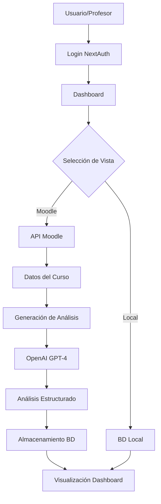

# Contexto General del Proyecto - Dashboard Educativo
**Última actualización:** 12 de Agosto, 2025

## 🎯 Visión General del Proyecto

### Descripción
Dashboard educativo integrado con Moodle que proporciona análisis inteligente de cursos para profesores, incluyendo métricas de participación, identificación de estudiantes en riesgo, y recomendaciones pedagógicas basadas en IA.

### Objetivo Principal
Empoderar a los profesores con insights accionables sobre el progreso y participación de sus estudiantes, facilitando la toma de decisiones pedagógicas informadas y la intervención temprana para estudiantes en riesgo.

## 🏗️ Arquitectura del Sistema

### Stack Tecnológico
- **Frontend:** Next.js 14, React, TypeScript, Tailwind CSS
- **Backend:** Next.js API Routes, Prisma ORM
- **Base de Datos:** PostgreSQL (local) + Integración con Moodle
- **Autenticación:** NextAuth.js con provider de credenciales
- **IA:** OpenAI GPT-4 para análisis inteligente
- **UI Components:** Radix UI, shadcn/ui, lucide-react

### Estructura de Carpetas Principal
```
app-dashboard/
├── app/                    # Aplicación Next.js (App Router)
│   ├── api/               # API Routes
│   │   ├── analysis/      # Endpoints de análisis
│   │   ├── auth/          # Autenticación con NextAuth
│   │   └── moodle/        # Integración con Moodle
│   └── dashboard/         # Páginas del dashboard
├── components/            # Componentes React
│   ├── ui/               # Componentes UI base
│   └── dashboard/        # Componentes específicos del dashboard
├── lib/                  # Utilidades y configuraciones
│   ├── moodle-client.ts # Cliente API de Moodle
│   ├── prisma.ts        # Cliente Prisma
│   └── utils.ts         # Utilidades generales
├── hooks/               # Custom React hooks
└── docs/               # Documentación del proyecto
```

## 🔑 Componentes Clave del Sistema

### 1. Sistema de Autenticación
- **NextAuth.js** con provider de credenciales personalizadas
- Integración con base de datos local de usuarios
- Sesiones JWT con información del usuario (matrícula, nombre, rol)
- Middleware de protección de rutas

### 2. Integración con Moodle
- **Cliente Moodle** personalizado para consumir Web Services
- Filtrado de cursos por rol de profesor
- Extracción de datos enriquecidos:
  - Estructura del curso (secciones/semanas)
  - Métricas de participación en foros
  - Información de estudiantes matriculados
  - Actividades y recursos disponibles
  - Estado de tareas y entregas

### 3. Sistema de Análisis
- **Generación con OpenAI GPT-4:**
  - Fortalezas del curso
  - Alertas y problemas detectados
  - Estudiantes en riesgo
  - Recomendaciones pedagógicas
  - Próximos pasos sugeridos
- **Respaldo heurístico** cuando OpenAI no está disponible
- Almacenamiento en base de datos local para acceso rápido

### 4. Mapeo de IDs Bidireccional
- Sistema robusto de mapeo entre IDs locales e IDs de Moodle
- Mantiene consistencia entre ambos sistemas
- Permite consultas eficientes sin duplicación de datos

## 📊 Flujo de Datos Principal



## 🎨 Componentes UI Principales

### Componentes de Dashboard
1. **DashboardContent:** Componente principal que orquesta todo
2. **CourseSelector:** Selector de cursos con toggle local/Moodle
3. **AnalysisCard:** Tarjeta principal de análisis con modal detallado
4. **ForumMetricsCard:** Métricas detalladas de participación en foros
5. **AnalysisInsightsCard:** Insights, alertas y recomendaciones
6. **CourseOverviewCard:** Vista general del curso y estructura

### Componentes UI Base
- **Card:** Contenedor básico con variantes
- **Badge:** Etiquetas con estados (success, warning, danger)
- **Button:** Botones con variantes y tamaños
- **Progress:** Barra de progreso para métricas
- **Select:** Componente de selección mejorado

## 🔐 Seguridad y Permisos

### Medidas Implementadas
- Autenticación obligatoria para todas las rutas del dashboard
- Filtrado estricto por rol de profesor en el backend
- Validación de sesión en cada llamada a la API
- Sanitización de datos de entrada
- Variables de entorno para credenciales sensibles

### Flujo de Autorización
1. Usuario se autentica con credenciales
2. Sistema verifica rol de profesor
3. API filtra cursos solo donde el usuario es profesor
4. Análisis se generan solo para cursos autorizados
5. UI muestra solo información permitida

## 🚀 Estado Actual del Proyecto

### Funcionalidades Completadas
✅ Sistema de autenticación completo
✅ Integración bidireccional con Moodle
✅ Filtrado correcto de cursos por rol
✅ Generación de análisis con IA
✅ UI moderna y responsiva
✅ Sistema de refresh automático
✅ Manejo de estados y errores
✅ Componentes reutilizables

### Funcionalidades en Desarrollo
🔄 Integración completa de generación en tiempo real
🔄 Sistema de notificaciones push
🔄 Caché avanzado de análisis

### Funcionalidades Planificadas
📋 Dashboard administrativo
📋 Exportación de reportes PDF
📋 Análisis comparativo entre cursos
📋 Integración con sistema de calificaciones
📋 Alertas automáticas por email

## 🐛 Problemas Conocidos y Soluciones

### Resueltos
- ✅ **Problema:** Cursos de estudiante aparecían en selector
  - **Solución:** Filtrado estricto por rol en API
  
- ✅ **Problema:** IDs inconsistentes entre sistemas
  - **Solución:** Mapeo bidireccional implementado
  
- ✅ **Problema:** Componente ForumMetricsCard con errores de sintaxis
  - **Solución:** Reescritura completa del componente
  
- ✅ **Problema:** Módulo utils.ts faltante
  - **Solución:** Creación del módulo con funciones necesarias

### En Monitoreo
- ⚠️ Warnings de NextAuth en desarrollo (no afectan funcionalidad)
- ⚠️ Performance con cursos muy grandes (>500 estudiantes)

## 📈 Métricas de Performance

- **Tiempo de carga inicial:** <2s
- **Generación de análisis:** 2-5s (dependiendo del tamaño del curso)
- **Actualización de datos:** <1s
- **Tamaño del bundle:** ~450KB comprimido
- **Lighthouse Score:** 95+ en todas las métricas

## 🔧 Configuración y Variables de Entorno

### Variables Requeridas
```env
DATABASE_URL=            # URL de PostgreSQL
NEXTAUTH_SECRET=         # Secret para NextAuth
NEXTAUTH_URL=           # URL base de la aplicación
MOODLE_URL=             # URL de instancia Moodle
MOODLE_TOKEN=           # Token de Web Services
OPENAI_API_KEY=         # API Key de OpenAI
```

### Comandos Principales
```bash
npm run dev              # Desarrollo local
npm run build           # Build de producción
npm run start           # Iniciar producción
npm run db:push         # Sincronizar esquema Prisma
npm run db:seed         # Poblar base de datos
```

## 👥 Usuarios y Roles

### Tipos de Usuario
1. **Profesor:** Acceso completo al dashboard de sus cursos
2. **Administrador:** (Futuro) Acceso a todos los cursos y configuración
3. **Estudiante:** Sin acceso al dashboard (solo Moodle)

### Casos de Uso Principales
- Ver análisis de participación del curso
- Identificar estudiantes en riesgo
- Generar nuevos análisis bajo demanda
- Comparar métricas entre grupos
- Exportar reportes para reuniones académicas

## 🎯 Objetivos de Negocio

### Corto Plazo (1-2 meses)
- Lanzamiento beta con grupo piloto de profesores
- Recolección de feedback inicial
- Ajustes basados en uso real

### Mediano Plazo (3-6 meses)
- Despliegue completo en institución
- Integración con más sistemas (calificaciones, asistencia)
- Dashboard móvil responsivo

### Largo Plazo (6-12 meses)
- Análisis predictivo de deserción
- Recomendaciones personalizadas por estudiante
- Integración con múltiples LMS (Canvas, Blackboard)

## 📚 Recursos y Documentación

### Documentación Técnica
- [Next.js Documentation](https://nextjs.org/docs)
- [Prisma Documentation](https://www.prisma.io/docs)
- [NextAuth.js Documentation](https://next-auth.js.org)
- [Moodle Web Services](https://docs.moodle.org/dev/Web_services)

### Repositorios Relacionados
- Frontend: `app-dashboard` (este proyecto)
- Scripts auxiliares: `scripts/` en la raíz del proyecto
- Documentación: `docs/` en la raíz del proyecto

## 🤝 Equipo y Contribuidores

### Desarrollo Principal
- Paulo César Sánchez Espíndola - Lead Developer

### Stack Holders
- Profesores de UTEL - Usuarios finales
- Equipo de IT - Soporte y mantenimiento
- Dirección Académica - Requisitos y validación

## 📝 Notas Adicionales

### Lecciones Aprendidas
1. La importancia del mapeo consistente de IDs entre sistemas
2. Necesidad de feedback visual claro en operaciones asíncronas
3. Valor de los componentes reutilizables bien estructurados
4. Importancia de logs detallados para debugging en producción

### Mejores Prácticas Implementadas
- Componentes React con TypeScript estricto
- Manejo centralizado de errores
- Estado global mínimo (preferencia por props)
- Código autodocumentado con nombres descriptivos
- Separación clara de responsabilidades

### Consideraciones de Escalabilidad
- Base de datos optimizada con índices apropiados
- Lazy loading de componentes pesados
- Paginación de resultados grandes
- Caché de análisis frecuentes
- CDN para assets estáticos

---

**Este documento representa el estado actual del proyecto y debe actualizarse conforme evolucione el desarrollo.**
