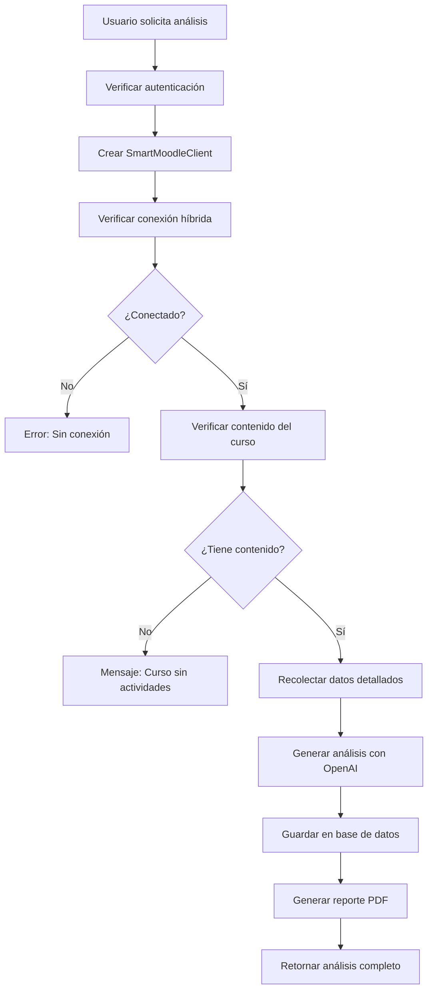

# Sistema de Tokens y Proceso de Análisis - Dashboard UTEL

## 📋 Resumen del Sistema de Tokens

### 1. **Tipos de Tokens**

#### 🔐 Token Administrativo (Global)
- **Variable**: `MOODLE_TOKEN` en `.env`
- **Usuario**: marco.arce (administrador del sistema)
- **Almacenamiento**: Variable de entorno
- **Alcance**: Lectura general de datos públicos

#### 👨‍🏫 Token del Profesor (Individual)
- **Almacenamiento**: Base de datos (tabla `UserMoodleToken`)
- **Usuario**: Cada profesor con su propio token
- **Configuración**: Manual o automática
- **Alcance**: Permisos completos sobre sus cursos

### 2. **Sistema de Autenticación Híbrida**

El sistema usa `HybridMoodleAuthService` que decide inteligentemente qué token usar:

```
┌─────────────────────────────────────┐
│     Solicitud de Operación          │
└──────────────┬──────────────────────┘
               │
               ▼
┌──────────────────────────────────────┐
│  ¿Requiere permisos específicos?     │
│  (crear contenido, calificar, etc.)  │
└──────────┬───────────┬───────────────┘
           │ SÍ        │ NO
           ▼           ▼
    ┌──────────┐  ┌──────────┐
    │  Token   │  │  Token   │
    │ Profesor │  │  Admin   │
    └──────────┘  └──────────┘
```

## 🔄 Proceso de Análisis Inteligente

### Flujo Completo del Análisis



### Pasos Detallados

#### 1. **Autenticación y Sesión**
```typescript
// Verificar que el usuario esté autenticado
const session = await getServerSession(authOptions)
if (!session?.user) {
  return error: 'No autorizado'
}
```

#### 2. **Creación del Cliente Inteligente**
```typescript
// Crear cliente con contexto del usuario
const smartClient = createSmartMoodleClient(
  session.user.id,     // ID del usuario en DB
  userMatricula        // Matrícula del profesor
)
```

#### 3. **Verificación de Conexión**
- Usa token del profesor si está disponible
- Fallback a token administrativo si es necesario
- Verifica que puede comunicarse con Moodle

#### 4. **Verificación de Contenido**
Verifica que el curso tenga:
- Foros de discusión
- Actividades (tareas, cuestionarios, etc.)
- Estructura de secciones

#### 5. **Recolección de Datos**
Obtiene información detallada sobre:
- **Estructura del curso**: Secciones, módulos, recursos
- **Participación en foros**: Discusiones, posts, respuestas
- **Tareas y entregas**: Estados, fechas, calificaciones
- **Estudiantes**: Matriculados, activos, inactivos
- **Grupos/Modalidades**: Filtrado específico

#### 6. **Análisis con IA (OpenAI GPT-4)**
Genera análisis sobre:
- 🏆 **Fortalezas**: Aspectos positivos del curso
- ⚠️ **Alertas**: Problemas detectados
- 👥 **Estudiantes en riesgo**: Identificación de alumnos con problemas
- 💡 **Recomendaciones**: Acciones sugeridas
- 📊 **Métricas**: Participación, entregas, actividad

#### 7. **Almacenamiento y Reporte**
- Guarda análisis en base de datos
- Genera PDF con detalles técnicos
- Registra métricas de uso (tokens, tiempo, costo)

## 🔍 Uso de Tokens por Servicio

### Operaciones con Token Administrativo
```javascript
// Operaciones de LECTURA general
- get_courses           // Obtener lista de cursos
- get_course_contents   // Obtener contenido del curso
- get_forum_discussions // Leer discusiones de foros
- get_assignments       // Ver tareas asignadas
- get_submissions      // Ver entregas (limitado)
- get_gradebook        // Ver libro de calificaciones
- get_user_info        // Información de usuarios
- get_groups           // Obtener grupos del curso
```

### Operaciones con Token del Profesor
```javascript
// Operaciones que REQUIEREN token específico
- create_assignment     // Crear tareas
- grade_submission      // Calificar entregas
- send_message         // Enviar mensajes a estudiantes
- create_forum_post    // Crear posts en foros
- edit_course_content  // Editar contenido del curso
- manage_enrollments   // Gestionar inscripciones
```

## 🎯 Decisión de Token - Lógica Actual

```typescript
async getOptimalToken(context: OperationContext): Promise<TokenInfo> {
  // 1. Si es operación sensible → Token Profesor
  if (professorOnlyOperations.includes(context.operation)) {
    return getProfessorToken(userMatricula)
  }
  
  // 2. Si es operación de lectura → Token Admin
  if (adminCompatibleOperations.includes(context.operation)) {
    return { token: MOODLE_TOKEN, type: 'admin' }
  }
  
  // 3. Fallback → Token Admin
  return { token: MOODLE_TOKEN, type: 'admin' }
}
```

## ⚠️ Problemas Actuales y Soluciones

### Problema 1: Datos Limitados con Token Admin
**Síntoma**: No se ven todas las entregas o participación
**Causa**: El token admin (marco.arce) no está inscrito en todos los cursos
**Solución**: Usar token del profesor para datos completos

### Problema 2: Análisis Muestra "0 estudiantes matriculados"
**Síntoma**: Dice 0 estudiantes pero hay actividad
**Causa**: Permisos limitados del token administrativo
**Solución**: Asegurar que se use token del profesor para `getEnrolledUsers`

### Problema 3: Foros Sin Participación
**Síntoma**: No se detectan posts en foros
**Causa**: Token no tiene permisos para ver posts privados
**Solución**: Usar token del profesor para acceso completo

## 🔧 Configuración Recomendada

### 1. **Para Desarrollo/Testing**
```env
# Token administrativo para operaciones generales
MOODLE_TOKEN=token_marco_arce

# Tokens específicos de profesores (opcional)
CESAR_MOODLE_TOKEN=token_cesar_espindola
PAULO_MOODLE_TOKEN=token_paulo_sanchez
```

### 2. **Para Producción**
- Cada profesor configura su token personal
- Sistema usa token del profesor para TODAS las operaciones de su curso
- Token admin solo como fallback para operaciones públicas

## 📊 Métricas del Sistema

### Información Registrada por Análisis
1. **Identificación**: requestId único
2. **Contexto**: curso, grupo, usuario
3. **Prompt de IA**: Completo enviado a OpenAI
4. **Respuesta**: Análisis generado
5. **Métricas**:
   - Tokens usados (prompt + completion)
   - Tiempo de procesamiento
   - Costo estimado
   - Modelo usado (gpt-4-turbo-preview)

### Archivos de Reporte
```
/reports/
  └── analysis_details_[timestamp].pdf
      ├── Datos del request
      ├── Prompt completo
      ├── Respuesta de IA
      └── Métricas de uso
```

## 🚀 Optimizaciones Futuras

### 1. **Cache de Tokens**
- Cachear tokens validados por 24 horas
- Renovación automática antes de expirar

### 2. **Análisis Incremental**
- Solo analizar cambios desde último análisis
- Reducir llamadas a API y uso de tokens

### 3. **Permisos Granulares**
- Mapear permisos específicos por operación
- Decisión más inteligente de qué token usar

### 4. **Métricas de Uso**
- Dashboard de uso de tokens
- Alertas de límites de API
- Optimización de costos

## 📝 Conclusión

El sistema actual usa un enfoque híbrido inteligente:
- **Token administrativo** para operaciones de lectura general
- **Token del profesor** para operaciones específicas y datos completos
- **Fallback automático** si no hay token del profesor

Para obtener análisis completos con todos los datos, es CRÍTICO que:
1. El profesor tenga su token configurado
2. El sistema use ese token para todas las operaciones del curso
3. Se verifiquen los permisos antes de cada operación

## 🔐 Seguridad

- Tokens encriptados en base de datos
- Nunca se exponen tokens en logs o UI
- Validación de permisos antes de cada operación
- Audit trail de todas las operaciones realizadas
